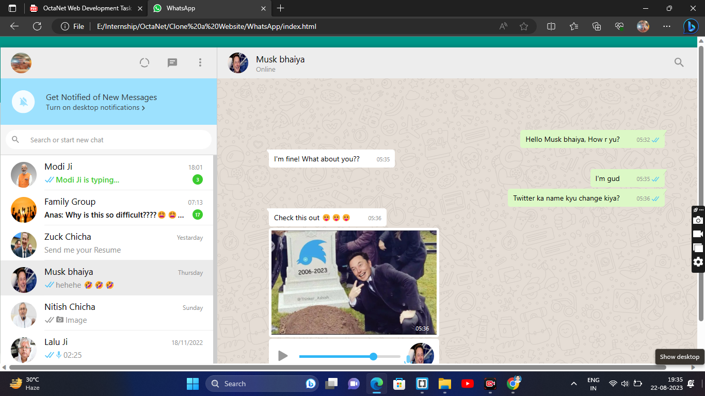

# WhatsApp web clone (UI) # OCTANET_AUG_Website_Clone (WhatsApp Web) with HTML, CSS and JavaScript.

This is a clone of WhatsApp Web using HTML and CSS (Grid and Flexbox).

[WhatsApp web user interface](./screenshot.png)

# Software Requirements :
IDE - Brackets
Tech Stack : HTML5, CSS3, JavaScript & Bootstrap4

Show some ❤️ by starring this repo.!

